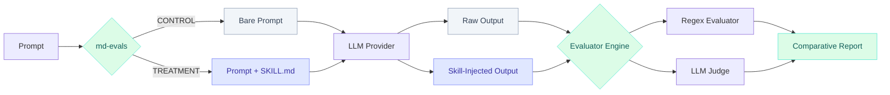

<!-- docs/README.md -->
# md-evals

> A lightweight, local-first CLI tool for evaluating AI skills (`SKILL.md`) with Control vs Treatment testing using LiteLLM.

## What is md-evals?

`md-evals` helps you answer a critical question when building AI agents: **"Does adding this skill actually improve the LLM's output?"**

It does this through rigorous A/B testing:



## Core Features

- 🔬 **A/B Testing** - Compare Control (no skill) vs Treatment (with skill) prompts
- 🔄 **Multiple Treatments** - Run wildcards like `LCC_*` to test multiple skill variations
- ⚖️ **Hybrid Evaluation** - Combine deterministic Regex patterns + heuristic LLM-as-a-judge 
- 🧹 **Linter** - Enforce the 400-line limit for `SKILL.md` to keep context windows healthy
- 📊 **Rich Output** - Beautiful terminal tables showing pass rates and time metrics
- 🔌 **Provider Agnostic** - Powered by LiteLLM (OpenAI, Anthropic, Gemini, local models)

## Why A/B Test AI Skills?

When writing instructions for AI agents (often called *System Prompts* or *Skills*), developers usually guess what works. Adding more instructions often leads to "Prompt Drift"—where fixing one edge case breaks three others.

`md-evals` brings engineering rigor to prompt engineering by letting you:
1. Define test cases.
2. Measure the baseline performance.
3. Inject the skill and measure the delta.

## Quick Links

- [🚀 Getting Started](./guide/getting-started.md)
- [⏱️ Quick Start](./guide/quick-start.md)
- [⚙️ Configuration Guide](./guide/configuration.md)
- [🧩 Evaluators](./guide/evaluators.md)

## Installation

```bash
uv pip install md-evals
```

## Quick Start

```bash
# Scaffold a new evaluation suite
md-evals init my-evaluation

# Go to directory
cd my-evaluation

# Run the evaluation
md-evals run
```

## Sponsor

[Star on GitHub](https://github.com/JNZader/md-evals)
