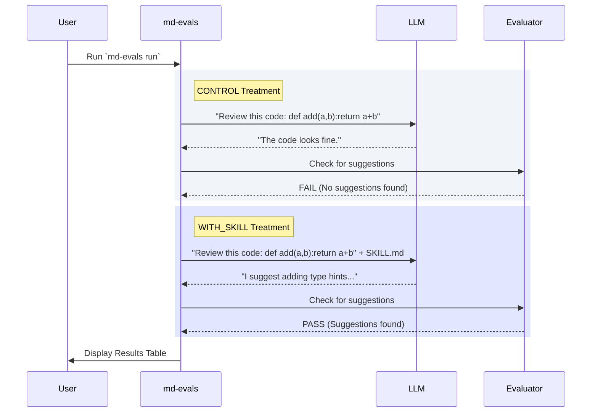

<!-- docs/examples/basic-evaluation.md -->
# Basic Evaluation

A simple example to test your first skill. We will build a basic "Code Reviewer" agent and evaluate if giving it explicit instructions actually makes it provide better reviews.

## The A/B Test Design



## Project Structure

```text
my-eval/
├── eval.yaml
├── SKILL.md
└── results/
```

## eval.yaml

```yaml
name: "Code Review Skill"
version: "1.0"

defaults:
  model: "gpt-4o"
  provider: "openai"

treatments:
  CONTROL:
    description: "No skill"
    skill_path: null
  
  WITH_SKILL:
    description: "With code review skill"
    skill_path: "./SKILL.md"

tests:
  - name: "review_quality"
    prompt: "Review this code:\n\n```python\n{x}\n```"
    variables:
      x: "def add(a,b):return a+b"
    evaluators:
      - type: "regex"
        name: "has_suggestions"
        pattern: "suggest|recommend|improve"
```

## SKILL.md

```markdown
# Code Review Skill

## Rules
- Always suggest improvements
- Be specific and actionable

## Examples
Input: Code to review
Output: Detailed review with suggestions
```

## Run

```bash
md-evals run
```

## Expected Output

```
╔══════════════════════════════════════════════════════════════════╗
║                    md-evals Results                                ║
╠══════════════════════════════════════════════════════════════════╣
║ Treatment              │ Checks    │ Score  │ Time               ║
╠══════════════════════════════════════════════════════════════════╣
║ CONTROL               │ 0/1 (0%)  │ 0.0    │ 1.2s               ║
║ WITH_SKILL            │ 1/1 (100%)│ 1.0    │ 1.4s               ║
╚══════════════════════════════════════════════════════════════════╝
```
