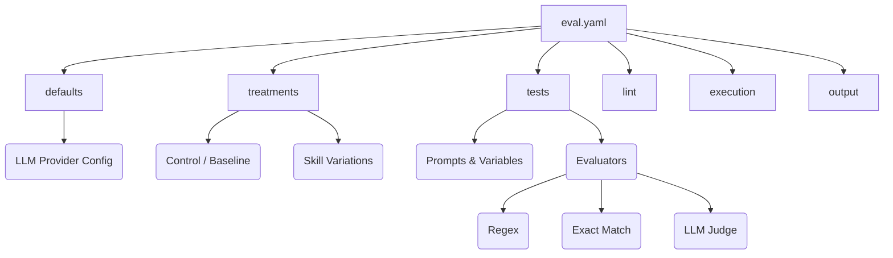

<!-- docs/guide/configuration.md -->
# Configuration Guide

The `eval.yaml` file is the heart of your md-evals project. It defines what to test, how to evaluate the results, and which skill variations (treatments) to compare.

## Architecture of eval.yaml



## Complete Example

Here is a comprehensive example covering all possible fields:

```yaml
name: "Code Generation Skill Evaluation"
version: "1.0"
description: "Testing if our python-developer skill improves code quality"

# 1. Default API settings
defaults:
  model: "gpt-4o"
  provider: "openai"
  temperature: 0.7
  max_tokens: 2048
  timeout: 60
  retry_attempts: 3

# 2. What to compare
treatments:
  # The baseline - absolutely no skill injected
  CONTROL:
    description: "Bare prompt without any skill context"
    skill_path: null
  
  # Variation A
  CONCISE_SKILL:
    description: "A very short, bullet-point skill"
    skill_path: "./skills/concise.md"
  
  # Variation B
  DETAILED_SKILL:
    description: "A highly detailed skill with examples"
    skill_path: "./skills/detailed.md"

# 3. What to test
tests:
  - name: "python_function_generation"
    description: "Check if the LLM generates a valid Python function"
    prompt: "Write a function to {task}. Do not include markdown formatting."
    variables:
      task: "sort a list of integers"
    
    # 4. How to measure success
    evaluators:
      - type: "regex"
        name: "has_def_keyword"
        pattern: "^def "
        pass_on_match: true
        fail_message: "Output must start with 'def'"

# 5. Skill health checks
lint:
  max_lines: 400
  fail_on_violation: true

# 6. How to run it
execution:
  parallel_workers: 2
  repetitions: 3
  fail_fast: false

# 7. Where to save results
output:
  format: "table"
  save_results: true
  results_dir: "./results"
```

## Section Deep Dives

### `defaults`

Configures how md-evals talks to the LLM. Powered by [LiteLLM](https://docs.litellm.ai/), meaning you can use almost any provider.

| Field | Type | Default | Description |
|-------|------|---------|-------------|
| `model` | string | `"gpt-4o"` | The model name exactly as expected by LiteLLM |
| `provider` | string | `"openai"` | The provider name (`openai`, `anthropic`, `gemini`, `ollama`) |
| `temperature` | float | `0.7` | Sampling temperature (0.0 = deterministic, 1.0 = creative) |
| `max_tokens` | int | `2048` | Maximum tokens to generate |
| `timeout` | int | `60` | Request timeout in seconds |
| `retry_attempts` | int | `3` | How many times to retry on API errors/rate limits |

### `treatments`

Treatments represent the different variations of your `SKILL.md` you want to test against the baseline.

| Field | Type | Description |
|-------|------|-------------|
| `description` | string | A human-readable description for reports |
| `skill_path` | string/null | Path to the SKILL.md file. **Must be `null` for CONTROL**. |
| `env` | object | Environment variables to inject (useful for advanced skills) |

> 💡 **Best Practice**: Always define a `CONTROL` treatment. Without a baseline, you can't prove your skill is actually doing anything useful!

### `tests`

The actual scenarios you are putting the LLM through.

| Field | Type | Description |
|-------|------|-------------|
| `name` | string | Unique identifier for the test |
| `description` | string | Human-readable explanation |
| `prompt` | string | The prompt template. Use `{variable_name}` for interpolation. |
| `variables` | object | Key-value pairs to inject into the prompt template |
| `evaluators` | list | An array of Evaluator objects. See [Evaluators Guide](./evaluators.md). |

### `lint`

Configures the SKILL.md linter.

| Field | Type | Default | Description |
|-------|------|---------|-------------|
| `max_lines` | int | `400` | The "Red Flag" threshold. Skills > 400 lines consume too much context. |
| `fail_on_violation` | bool | `true` | If true, `md-evals run` will abort if the linter fails. |

### `execution`

Controls how tests are executed.

| Field | Type | Default | Description |
|-------|------|---------|-------------|
| `parallel_workers` | int | `1` | Number of concurrent API requests. Increase to speed up testing. |
| `repetitions` | int | `1` | How many times to run each test. LLMs are non-deterministic, so `repetitions: 5` gives you statistical significance. |
| `fail_fast` | bool | `false` | Stop execution immediately if any test fails. |

### `output`

Controls reporting.

| Field | Type | Default | Description |
|-------|------|---------|-------------|
| `format` | string | `"table"` | Terminal output format (`table`, `json`, `markdown`) |
| `save_results` | bool | `true` | Whether to write results to disk |
| `results_dir` | string | `"./results"`| Directory to save JSON/Markdown reports |
| `verbose` | bool | `false` | Print detailed evaluator reasoning to the terminal |
