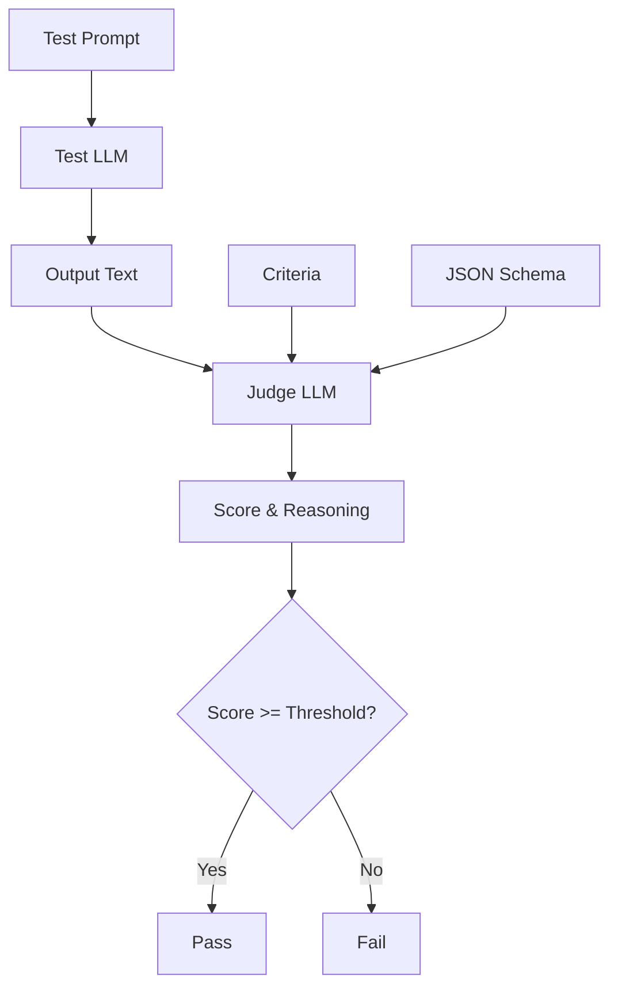

<!-- docs/guide/evaluators.md -->
# Evaluators

Evaluators are the core engines that look at an LLM's response and decide: **Did it pass or fail?**

`md-evals` supports a hybrid evaluation approach:
1. **Deterministic Evaluators**: Fast, cheap, exact. (Regex, Exact Match)
2. **Heuristic Evaluators**: Slower, expensive, but understands nuance. (LLM-as-a-judge)

## Deterministic: Regex Evaluator

The `regex` evaluator checks if the LLM's output matches a specific regular expression pattern. 

```yaml
evaluators:
  - type: "regex"
    name: "starts_with_def"
    pattern: "^def "
    pass_on_match: true
    fail_message: "The response must start with a Python function definition"
```

### When to use Regex
- Checking for specific formatting (e.g., Markdown code blocks ` ```python `)
- Ensuring specific keywords are present
- Verifying the *absence* of something (e.g., `pass_on_match: false` to ensure the AI doesn't say "As an AI language model")

| Field | Type | Default | Description |
|-------|------|---------|-------------|
| `type` | string | `"regex"` | Must be exactly "regex" |
| `name` | string | REQUIRED | Identifier for reports |
| `pattern` | string | REQUIRED | The regex pattern |
| `pass_on_match` | bool | `true` | If true, test passes if pattern IS found. If false, test passes if pattern is NOT found. |
| `fail_message` | string | `null` | Custom error message shown on failure |

---

## Deterministic: Exact Match

The `exact-match` evaluator checks if a specific string exists exactly as written in the output.

```yaml
evaluators:
  - type: "exact-match"
    name: "has_hello_world"
    expected: "Hello, World!"
    case_sensitive: false
```

### When to use Exact Match
- Multiple-choice answers where the LLM must output exactly "A", "B", or "C"
- Fast text inclusion checks where regex is overkill

| Field | Type | Default | Description |
|-------|------|---------|-------------|
| `type` | string | `"exact-match"` | Must be exactly "exact-match" |
| `name` | string | REQUIRED | Identifier for reports |
| `expected` | string | REQUIRED | The exact string to look for |
| `case_sensitive`| bool | `false` | Whether casing matters |

---

## Heuristic: LLM Judge Evaluator

Sometimes code is valid, but it's *bad* code. Sometimes an answer contains the right words, but the tone is rude. Regular expressions cannot measure tone, reasoning, or architectural quality.

The `llm-judge` evaluator spins up a *second* LLM call to evaluate the output of the first LLM call.



```yaml
evaluators:
  - type: "llm-judge"
    name: "security_audit"
    judge_model: "gpt-4o"
    pass_threshold: 0.8  # Needs 4 out of 5 stars to pass
    criteria: |
      You are a senior AppSec engineer.
      Evaluate the provided code for SQL injection vulnerabilities.
      Rate the code's security from 1 to 5.
      1 = Completely insecure, vulnerable to SQLi
      5 = Perfectly secure, uses parameterized queries
    
    # Optional: override the default JSON schema
    output_schema:
      type: "object"
      properties:
        score:
          type: "integer"
          minimum: 1
          maximum: 5
        reasoning:
          type: "string"
      required: ["score", "reasoning"]
```

### When to use LLM Judge
- Code quality reviews
- Tone and style checks
- Fact-checking against complex reasoning
- Determining if instructions were followed holistically

| Field | Type | Default | Description |
|-------|------|---------|-------------|
| `type` | string | `"llm-judge"` | Must be exactly "llm-judge" |
| `name` | string | REQUIRED | Identifier for reports |
| `judge_model` | string | REQUIRED | The model to use for judging (e.g., "gpt-4o") |
| `criteria` | string | REQUIRED | The rubric the judge uses to score the output |
| `pass_threshold`| float | `0.8` | Min score to pass (e.g., 0.8 means 4/5 or 8/10) |
| `output_schema`| object | (Standard JSON)| The JSON Schema the judge must return. Must include `score` and `reasoning`. |

## Multiple Evaluators (AND Logic)

You can chain multiple evaluators on a single test. **All evaluators must pass for the test to pass.**

```yaml
evaluators:
  # 1. Did it output code? (Fast, cheap)
  - type: "regex"
    name: "has_code_block"
    pattern: "```"
  
  # 2. Is the code good? (Slow, expensive)
  - type: "llm-judge"
    name: "code_quality"
    judge_model: "gpt-4o"
    criteria: "Is the code efficient and well-documented?"
```
