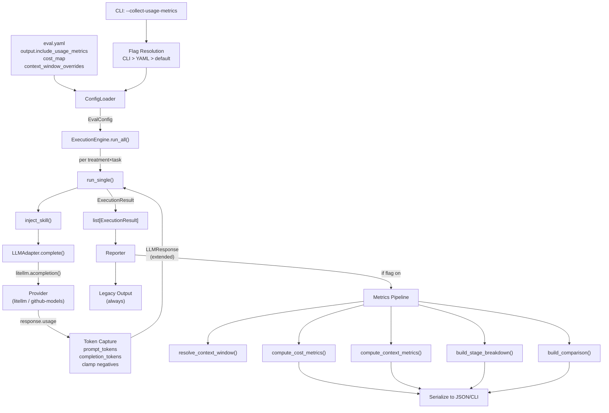

# Design: split-cost-vs-context-metrics-orchestrator-comparison

**Version**: 1.0  
**Status**: Draft  
**Fecha**: 2026-03-15  
**Spec**: [`spec.md`](./spec.md)  
**Proposal**: [`proposal.md`](./proposal.md)

---

## 1. Decisiones de Arquitectura

### ADR-01: Captura de tokens en `LLMAdapter.complete()`, no en providers ni en engine

**Contexto**: Hoy `LLMAdapter.complete()` (línea 99-102 de `llm.py`) ya extrae `completion_tokens` del response de litellm. Los providers individuales como `GitHubModelsProvider` también extraen tokens (línea 419-422 de `github_models.py`), pero devuelven un `LLMResponse` plano con solo `tokens: int`.

**Decisión**: La captura de `prompt_tokens`, `completion_tokens` y `total_tokens` se hace **en `LLMAdapter.complete()`**, extrayendo de `response.usage` del objeto litellm. No se modifica ningún provider individual.

**Razones**:
- `LLMAdapter` es el punto único de salida para todos los providers via litellm — un solo lugar de captura.
- Los providers directos (como `GitHubModelsProvider`) que no pasan por litellm tendrán su propio path de captura, pero devuelven el mismo `LLMResponse` extendido.
- El engine no debería saber de tokens crudos — solo consume `LLMResponse` y acumula.

**Consecuencia**: `LLMResponse` se extiende con campos opcionales (`prompt_tokens`, `completion_tokens` con nombre explícito). El campo legacy `tokens` sigue siendo `completion_tokens` y no se toca.

---

### ADR-02: Resolución de `context_window_max_tokens` — cadena de fallback

**Contexto**: Necesitamos saber la capacidad máxima del modelo para calcular context_metrics. Este dato puede venir de múltiples fuentes.

**Decisión**: Cadena de resolución con prioridad:

```
1. eval.yaml → context_window_overrides.{model_name}  (config explícita del usuario)
2. Provider metadata → SUPPORTED_MODELS[model].context_window  (ya existe en GitHubModelsProvider)
3. LiteLLM model registry → litellm.get_model_info(model).max_input_tokens
4. null → todas las métricas derivadas de contexto serán null/default seguro
```

**Razones**:
- El usuario puede tener información más precisa (modelos fine-tuneados, context windows reducidos por API proxy).
- Los providers ya almacenan `context_window` en `ModelMetadata` — reutilizamos.
- LiteLLM mantiene un registry bastante completo como último fallback.
- Nunca falla — `null` es un estado válido y toda la spec lo maneja.

**Implementación**: Se crea una función `resolve_context_window(model: str, provider: str, config: EvalConfig) -> int | None` en un nuevo módulo `md_evals/metrics.py`.

---

### ADR-03: `cost_metrics` y `context_metrics` como dataclasses separadas, no dicts

**Contexto**: La spec define dos domains con campos distintos. Podrían ser dicts libres o dataclasses tipadas.

**Decisión**: Dataclasses con `@dataclass` de stdlib (no Pydantic) para las métricas internas. Solo se serializan a dict al momento de reportar.

**Razones**:
- Las métricas son objetos de cómputo interno, no modelos de API — Pydantic es overkill.
- Dataclasses dan tipado estricto, inmutabilidad opcional, y son más ligeras.
- La conversión a dict para JSON se hace en el reporter con `dataclasses.asdict()`.
- Consistente con `ModelMetadata` en `github_models.py` que ya usa `@dataclass`.

---

### ADR-04: `stage_type` como metadata en `LLMResponse`, sin cambiar el pipeline

**Contexto**: La spec requiere etiquetar cada llamada LLM con un `stage_type`. Hoy md-evals ejecuta una sola llamada por test case (single-pass). El orquestador futuro hará múltiples llamadas.

**Decisión**:
- Se agrega `stage_type: str = "single_pass"` como campo opcional en `LLMResponse`.
- El engine actual no cambia — toda llamada es `single_pass` por defecto.
- Un futuro orquestador asignará `planner`, `router`, `tool_call`, `synthesis` al invocar `LLMAdapter.complete()`.
- El stage_type se pasa como parámetro a `complete()` y se almacena en el response.

**Razones**:
- Cero impacto en el pipeline actual — `single_pass` es el default.
- El orquestador (spec futura) solo necesita pasar un string al llamar a complete.
- No se necesita refactoring del engine ni de la evaluación.

---

### ADR-05: Feature flag como campo en `OutputConfig`, resuelto en CLI

**Contexto**: El flag `include_usage_metrics` debe fluir desde CLI/YAML hasta el reporter.

**Decisión**: Se agrega `include_usage_metrics: bool = False` a `OutputConfig` (ya existente en `models.py`). El CLI resuelve la precedencia (CLI > YAML > default) y setea el valor final en `config.output.include_usage_metrics` antes de pasar al engine/reporter.

**Razones**:
- `OutputConfig` ya existe y es el lugar natural para flags de output.
- La resolución de precedencia se hace una sola vez en `cli.py`, antes de crear el engine.
- Engine y reporter solo leen `config.output.include_usage_metrics` — no necesitan saber de CLI vs YAML.

---

## 2. Modelo de Datos

### 2.1 Nuevas dataclasses — `md_evals/metrics.py` (archivo nuevo)

```python
"""Usage metrics dataclasses for cost and context tracking."""

from __future__ import annotations
from dataclasses import dataclass, field
from enum import Enum


class DataQuality(str, Enum):
    MEASURED = "measured"
    ESTIMATED = "estimated"
    UNAVAILABLE = "unavailable"


class TruncationRisk(str, Enum):
    LOW = "low"
    MEDIUM = "medium"
    HIGH = "high"
    UNKNOWN = "unknown"


class AttributionQuality(str, Enum):
    HIGH = "high"
    MEDIUM = "medium"
    LOW = "low"


# ─── Token Capture (raw from provider) ───

@dataclass(frozen=True)
class TokenUsage:
    """Raw token usage from a single LLM call."""
    prompt_tokens: int | None = None
    completion_tokens: int | None = None
    total_tokens: int | None = None
    source: DataQuality = DataQuality.UNAVAILABLE


# ─── Cost Domain ───

@dataclass
class CostMetrics:
    """Cost-oriented metrics for a variant (accumulated across all calls)."""
    prompt_tokens: int = 0
    completion_tokens: int = 0
    total_tokens: int = 0
    estimated_cost_usd: float | None = None
    latency_ms: int = 0
    data_quality: DataQuality = DataQuality.UNAVAILABLE


# ─── Context Domain ───

@dataclass
class ContextMetrics:
    """Context window risk metrics for a variant."""
    prompt_tokens_used: int = 0
    context_window_max_tokens: int | None = None
    context_utilization_pct: float | None = None
    headroom_tokens: int | None = None
    safe_headroom_tokens: int | None = None
    max_tokens_request: int = 0
    overflow: bool = False
    overflow_tokens: int = 0
    truncation_risk: TruncationRisk = TruncationRisk.UNKNOWN
    data_quality: DataQuality = DataQuality.UNAVAILABLE


# ─── Stage Breakdown ───

@dataclass
class StageMetrics:
    """Metrics for a single LLM call stage."""
    stage_type: str                     # "planner", "router", "tool_call", "synthesis", "single_pass"
    prompt_tokens: int = 0
    completion_tokens: int = 0
    total_tokens: int = 0
    tool_io_tokens: int = 0
    latency_ms: int = 0
    attribution_quality: AttributionQuality = AttributionQuality.HIGH


# ─── Per-Variant Aggregation ───

@dataclass
class VariantMetrics:
    """Aggregated metrics for one variant (orchestrator or non_orchestrator)."""
    pipeline_mode: str                  # "orchestrator" | "non_orchestrator"
    cost_metrics: CostMetrics = field(default_factory=CostMetrics)
    context_metrics: ContextMetrics = field(default_factory=ContextMetrics)
    stage_breakdown: list[StageMetrics] = field(default_factory=list)


# ─── Comparison Delta ───

@dataclass
class MetricDelta:
    """Delta between orchestrator and non_orchestrator for one metric."""
    orchestrator: float | int | bool | None = None
    non_orchestrator: float | int | bool | None = None
    delta_abs: float | int | None = None
    delta_pct: float | None = None
    delta_pct_reason: str | None = None  # "baseline_zero", "boolean_metric", etc.


# ─── Cost Rate Config ───

@dataclass(frozen=True)
class CostRate:
    """Cost rate for a model (USD per million tokens)."""
    input_rate_per_million: float
    output_rate_per_million: float
```

### 2.2 Extensión de modelos existentes — `md_evals/models.py`

```python
# ─── LLMResponse: campos NUEVOS opcionales (legacy "tokens" intacto) ───

class LLMResponse(BaseModel):
    """LLM response model."""
    content: str
    model: str
    provider: str
    tokens: int = 0                           # LEGACY — no renombrar, no remover
    duration_ms: int = 0
    raw_response: dict[str, Any] = Field(default_factory=dict)
    # ─── NUEVOS (aditivos) ───
    prompt_tokens: int | None = None          # Nuevo: tokens de input
    completion_tokens_detail: int | None = None  # Nuevo: tokens de output (explícito)
    total_tokens: int | None = None           # Nuevo: prompt + completion
    stage_type: str = "single_pass"           # Nuevo: label de etapa


# ─── OutputConfig: flag de usage metrics ───

class OutputConfig(BaseModel):
    """Output configuration."""
    format: Literal["table", "json", "markdown"] = "table"
    save_results: bool = True
    results_dir: str = "./results"
    verbose: bool = False
    include_usage_metrics: bool = False        # NUEVO — default off


# ─── EvalConfig: cost_map y context_window_overrides ───

class EvalConfig(BaseModel):
    """Top-level evaluation configuration."""
    name: str
    version: str = "1.0"
    description: str | None = None
    defaults: Defaults = Field(default_factory=Defaults)
    treatments: dict[str, Treatment] = Field(default_factory=dict)
    models: list[ModelConfig] = Field(default_factory=list)
    lint: LinterConfig = Field(default_factory=LinterConfig)
    tests: list[Task] = Field(default_factory=list)
    output: OutputConfig = Field(default_factory=OutputConfig)
    execution: ExecutionConfig = Field(default_factory=ExecutionConfig)
    # ─── NUEVOS ───
    cost_map: dict[str, dict[str, float]] = Field(default_factory=dict)
    context_window_overrides: dict[str, int] = Field(default_factory=dict)
```

### 2.3 Relación con modelos existentes (extensión, no reemplazo)

```
┌──────────────────────────────┐
│       ExecutionResult        │  ← No cambia estructura
│  .response: LLMResponse      │
│  .treatment, .test, .passed  │
│  .evaluator_results          │
│  .timestamp                  │
└──────────┬───────────────────┘
           │
           │  LLMResponse EXTENDIDO:
           ▼
┌──────────────────────────────┐
│         LLMResponse          │
│  .content, .model, .provider │
│  .tokens (LEGACY, intacto)   │
│  .duration_ms                │
│  .raw_response               │
│  ─── nuevos ───              │
│  .prompt_tokens: int | None  │
│  .completion_tokens_detail   │
│  .total_tokens: int | None   │
│  .stage_type: str            │
└──────────────────────────────┘

Las métricas agregadas (CostMetrics, ContextMetrics, VariantMetrics)
NO viven dentro de ExecutionResult — se calculan post-ejecución en
el reporter/aggregation layer a partir de la lista de ExecutionResults.
```

---

## 3. Pipeline de Instrumentación

### 3.1 Flujo paso a paso

```
1. CLI parsea flags
   ├─ --collect-usage-metrics → config.output.include_usage_metrics = True
   └─ Precedencia: CLI flag > YAML config > default (False)

2. Engine ejecuta evaluaciones (sin cambios en lógica)
   └─ Cada llamada pasa por LLMAdapter.complete()

3. LLMAdapter.complete() — PUNTO DE CAPTURA
   ├─ Mide latency_ms (ya existente, línea 71+91 de llm.py)
   ├─ Extrae response.usage.prompt_tokens         ← NUEVO
   ├─ Extrae response.usage.completion_tokens      (ya existe, ahora nombrado)
   ├─ Calcula total = prompt + completion           ← NUEVO
   ├─ Determina data_quality (measured/estimated)   ← NUEVO
   └─ Retorna LLMResponse con campos nuevos poblados

4. Reporter recibe list[ExecutionResult]
   ├─ Si include_usage_metrics == False → output legacy, STOP
   └─ Si include_usage_metrics == True:
       ├─ 4a. Agrupa results por treatment
       ├─ 4b. Resuelve context_window_max_tokens (ADR-02)
       ├─ 4c. Calcula CostMetrics por variant
       ├─ 4d. Calcula ContextMetrics por variant
       ├─ 4e. Construye stage_breakdown por variant
       ├─ 4f. Calcula comparison deltas
       └─ 4g. Serializa bloque usage_metrics en output
```

### 3.2 Captura en `LLMAdapter.complete()` — diff conceptual

Archivo: `md_evals/llm.py`, método `complete()`.

**Antes** (líneas 99-111 actuales):
```python
# Count tokens (approximate)
tokens = 0
if hasattr(response, "usage") and response.usage:
    tokens = response.usage.completion_tokens or 0

return LLMResponse(
    content=content,
    model=self.model,
    provider=self.provider,
    tokens=tokens,
    duration_ms=duration_ms,
    raw_response=response.model_dump() if hasattr(response, "model_dump") else {}
)
```

**Después**:
```python
# Extract token usage
tokens = 0                     # Legacy field
prompt_tokens = None
completion_tokens_detail = None
total_tokens_val = None
data_quality_source = "unavailable"

if hasattr(response, "usage") and response.usage:
    usage = response.usage
    completion_tokens_detail = getattr(usage, "completion_tokens", None)
    prompt_tokens = getattr(usage, "prompt_tokens", None)

    # Legacy field — mantener backward compat
    tokens = completion_tokens_detail or 0

    # Total
    if prompt_tokens is not None and completion_tokens_detail is not None:
        total_tokens_val = prompt_tokens + completion_tokens_detail
        data_quality_source = "measured"
    elif completion_tokens_detail is not None:
        data_quality_source = "estimated"

    # Clamp negativos (EC-03 de spec)
    if prompt_tokens is not None and prompt_tokens < 0:
        prompt_tokens = 0
        data_quality_source = "estimated"

return LLMResponse(
    content=content,
    model=self.model,
    provider=self.provider,
    tokens=tokens,                              # LEGACY intacto
    duration_ms=duration_ms,
    raw_response=response.model_dump() if hasattr(response, "model_dump") else {},
    prompt_tokens=prompt_tokens,                # NUEVO
    completion_tokens_detail=completion_tokens_detail,  # NUEVO
    total_tokens=total_tokens_val,              # NUEVO
    stage_type=stage_type,                      # NUEVO (parámetro del método)
)
```

### 3.3 Resolución de `context_window_max_tokens`

Función en `md_evals/metrics.py`:

```python
def resolve_context_window(
    model: str,
    provider: str,
    config: EvalConfig,
) -> int | None:
    """Resolve context window size with fallback chain.

    Priority:
    1. config.context_window_overrides[model]
    2. Provider metadata (e.g., GitHubModelsProvider.SUPPORTED_MODELS)
    3. litellm.get_model_info(model)
    4. None
    """
    # 1. Config override
    if model in config.context_window_overrides:
        return config.context_window_overrides[model]

    # 2. Provider metadata
    try:
        from md_evals.provider_registry import ProviderRegistry
        provider_class = ProviderRegistry.get(provider)
        if hasattr(provider_class, "supported_models"):
            models = provider_class.supported_models()
            if model in models:
                return models[model].context_window
    except (ValueError, AttributeError):
        pass

    # 3. LiteLLM registry
    try:
        import litellm
        info = litellm.get_model_info(model)
        if info and "max_input_tokens" in info:
            return info["max_input_tokens"]
    except Exception:
        pass

    # 4. Unknown
    return None
```

### 3.4 Cálculo de métricas derivadas

Funciones puras en `md_evals/metrics.py`:

```python
def compute_cost_metrics(
    results: list[ExecutionResult],
    cost_map: dict[str, dict[str, float]],
    model: str,
) -> CostMetrics:
    """Aggregate cost metrics from a list of execution results."""
    total_prompt = 0
    total_completion = 0
    total_latency = 0
    quality = DataQuality.UNAVAILABLE

    for r in results:
        resp = r.response
        if resp.prompt_tokens is not None:
            total_prompt += resp.prompt_tokens
            quality = DataQuality.MEASURED
        if resp.completion_tokens_detail is not None:
            total_completion += resp.completion_tokens_detail
        total_latency += resp.duration_ms

    total_tokens = total_prompt + total_completion

    # Cost calculation
    estimated_cost = None
    if model in cost_map:
        rates = cost_map[model]
        input_rate = rates.get("input_rate_per_million", 0)
        output_rate = rates.get("output_rate_per_million", 0)
        estimated_cost = (total_prompt * input_rate + total_completion * output_rate) / 1_000_000

    return CostMetrics(
        prompt_tokens=total_prompt,
        completion_tokens=total_completion,
        total_tokens=total_tokens,
        estimated_cost_usd=estimated_cost,
        latency_ms=total_latency,
        data_quality=quality,
    )


def compute_context_metrics(
    results: list[ExecutionResult],
    context_window: int | None,
    max_tokens_request: int,
) -> ContextMetrics:
    """Compute context metrics for a variant.

    Uses the MAX prompt_tokens across all calls (worst-case context pressure).
    For orchestrator mode, this is the call with the largest prompt.
    """
    max_prompt = 0
    quality = DataQuality.UNAVAILABLE

    for r in results:
        if r.response.prompt_tokens is not None:
            max_prompt = max(max_prompt, r.response.prompt_tokens)
            quality = DataQuality.MEASURED

    # Derived calculations (spec §3.2 formulas)
    utilization = None
    headroom = None
    safe_headroom = None
    overflow = False
    overflow_tokens = 0
    risk = TruncationRisk.UNKNOWN

    if context_window is not None and context_window > 0:
        utilization = (max_prompt / context_window) * 100
        headroom = max(context_window - max_prompt, 0)
        safe_headroom = max(context_window - max_prompt - max_tokens_request, 0)
        overflow = max_prompt > context_window
        overflow_tokens = max(max_prompt - context_window, 0)

        # Truncation risk thresholds
        if utilization < 70:
            risk = TruncationRisk.LOW
        elif utilization < 90:
            risk = TruncationRisk.MEDIUM
        else:
            risk = TruncationRisk.HIGH
    elif context_window == 0:
        overflow = max_prompt > 0
        overflow_tokens = max_prompt
        headroom = 0
        safe_headroom = 0
    # else: context_window is None → all derived stay null/default

    return ContextMetrics(
        prompt_tokens_used=max_prompt,
        context_window_max_tokens=context_window,
        context_utilization_pct=utilization,
        headroom_tokens=headroom,
        safe_headroom_tokens=safe_headroom,
        max_tokens_request=max_tokens_request,
        overflow=overflow,
        overflow_tokens=overflow_tokens,
        truncation_risk=risk,
        data_quality=quality,
    )
```

### 3.5 Cálculo de deltas de comparación

```python
def compute_delta(
    orq_value: float | int | None,
    non_orq_value: float | int | None,
    is_boolean: bool = False,
) -> MetricDelta:
    """Compute comparison delta between two variant values."""
    if is_boolean:
        return MetricDelta(
            orchestrator=orq_value,
            non_orchestrator=non_orq_value,
            delta_abs=None,
            delta_pct=None,
            delta_pct_reason="boolean_metric",
        )

    if orq_value is None or non_orq_value is None:
        reason = "variant_not_executed" if (orq_value is None or non_orq_value is None) else None
        return MetricDelta(
            orchestrator=orq_value,
            non_orchestrator=non_orq_value,
            delta_abs=None,
            delta_pct=None,
            delta_pct_reason=reason,
        )

    delta_abs = orq_value - non_orq_value

    if non_orq_value == 0:
        return MetricDelta(
            orchestrator=orq_value,
            non_orchestrator=non_orq_value,
            delta_abs=delta_abs,
            delta_pct=None,
            delta_pct_reason="baseline_zero",
        )

    delta_pct = (delta_abs / non_orq_value) * 100

    return MetricDelta(
        orchestrator=orq_value,
        non_orchestrator=non_orq_value,
        delta_abs=delta_abs,
        delta_pct=round(delta_pct, 2),
    )
```

---

## 4. Agregación y Reporte

### 4.1 Agregación por treatment

El reporter agrupa `list[ExecutionResult]` por treatment name. Para la V1 (spec actual, sin agregaciones estadísticas — ver spec §9), las métricas son **sumas** (tokens, latency, cost) y **worst-case** (context utilization usa max prompt_tokens).

```python
# En reporter, pseudo-código del flujo:

def _build_usage_metrics(self, results: list[ExecutionResult]) -> dict | None:
    """Build usage_metrics block. Returns None if flag is off."""
    if not self.config.output.include_usage_metrics:
        return None

    model = self.config.defaults.model
    provider = self.config.defaults.provider
    context_window = resolve_context_window(model, provider, self.config)
    max_tokens_req = self.config.defaults.max_tokens

    # Group by treatment → map to variant
    by_treatment = group_by_treatment(results)
    variants = {}

    for treatment_name, treatment_results in by_treatment.items():
        cost = compute_cost_metrics(treatment_results, self.config.cost_map, model)
        context = compute_context_metrics(treatment_results, context_window, max_tokens_req)
        stages = build_stage_breakdown(treatment_results)

        # Determine pipeline_mode
        # For V1: all treatments are "non_orchestrator" (single_pass)
        # Future: detect based on stage_types present
        has_multi_stage = any(
            r.response.stage_type != "single_pass" for r in treatment_results
        )
        mode = "orchestrator" if has_multi_stage else "non_orchestrator"

        variants[treatment_name] = VariantMetrics(
            pipeline_mode=mode,
            cost_metrics=cost,
            context_metrics=context,
            stage_breakdown=stages,
        )

    # Build comparison (if 2+ variants exist)
    comparison = build_comparison(variants) if len(variants) >= 2 else None

    return serialize_usage_metrics(model, provider, context_window, max_tokens_req, variants, comparison)
```

### 4.2 Extensión del JSON output

En `reporter.py`, método `_build_output_data()`:

```python
def _build_output_data(self, results: list[ExecutionResult]) -> dict[str, Any]:
    output = {
        "experiment_id": ...,     # existente
        "timestamp": ...,         # existente
        "config": ...,            # existente
        "results": [...],         # existente, LEGACY intacto
        "summary": {...},         # existente
    }

    # ─── NUEVOS campos condicionales ───
    usage_metrics = self._build_usage_metrics(results)
    if usage_metrics is not None:
        output["report_schema_version"] = "2.0"
        output["feature_flags"] = {"include_usage_metrics": True}
        output["usage_metrics"] = usage_metrics
    # Si flag off → output NO tiene estas keys → backward compat (AC-02)

    return output
```

### 4.3 Extensión de la tabla CLI

El método `report_terminal()` agrega secciones **opcionales** después de la tabla principal existente:

```python
def report_terminal(self, results: list[ExecutionResult], verbose: bool = False) -> None:
    # ... tabla principal existente (no cambia) ...

    # ─── NUEVO: secciones de usage metrics ───
    if self.config.output.include_usage_metrics:
        usage = self._build_usage_metrics(results)
        if usage:
            self._print_cost_metrics_table(usage)
            self._print_context_metrics_table(usage)
            self._print_comparison_table(usage)
```

### 4.4 Formato propuesto de tabla CLI

```
╭─────────────────── Cost Metrics ────────────────────╮
│ Treatment    │ Prompt │ Compl. │ Total  │ Cost USD   │
│──────────────┼────────┼────────┼────────┼────────────│
│ CONTROL      │ 25,000 │  6,000 │ 31,000 │ $0.1225    │
│ WITH_SKILL   │ 32,000 │  8,500 │ 40,500 │ $0.1650    │
╰─────────────────────────────────────────────────────╯

╭──────────────────── Context Metrics ────────────────────╮
│ Treatment    │ Used   │ Window  │ Util%  │ Headroom │ Risk   │
│──────────────┼────────┼─────────┼────────┼──────────┼────────│
│ CONTROL      │ 25,000 │ 128,000 │ 19.5%  │ 103,000  │ low    │
│ WITH_SKILL   │ 32,000 │ 128,000 │ 25.0%  │  96,000  │ low    │
╰─────────────────────────────────────────────────────────╯

╭─────────── Comparison (WITH_SKILL vs CONTROL) ──────────╮
│ Metric       │ CONTROL │ WITH_SKILL │ Delta  │ Delta%   │
│──────────────┼─────────┼────────────┼────────┼──────────│
│ total_tokens │  31,000 │     40,500 │ +9,500 │ +30.65%  │
│ cost_usd     │ $0.1225 │    $0.1650 │+$0.043 │ +34.69%  │
│ utilization  │  19.53% │     25.00% │ +5.47% │ +28.01%  │
│ headroom     │ 103,000 │     96,000 │ -7,000 │  -6.80%  │
╰─────────────────────────────────────────────────────────╯
```

Las tablas se renderizan con Rich `Table` existente (ya importado en reporter.py). Columnas con `justify="right"` para números. Colores: verde para mejoras, rojo para degradaciones en deltas.

---

## 5. Feature Flags y Configuración

### 5.1 Precedencia

```
CLI --collect-usage-metrics         →  True (fuerza on)
CLI --no-collect-usage-metrics      →  False (fuerza off)
CLI sin flag                        →  defer al YAML
YAML output.include_usage_metrics   →  True/False
Default                             →  False
```

### 5.2 Resolución en `cli.py`

```python
# En el comando run(), después de cargar config:

@app.command()
def run(
    # ... flags existentes ...
    collect_usage_metrics: Annotated[
        Optional[bool],
        typer.Option(
            "--collect-usage-metrics/--no-collect-usage-metrics",
            help="Collect extended usage metrics (cost + context)"
        )
    ] = None,  # None = no pasado en CLI → usar YAML
):
    # ... config loading existente ...

    # Resolve usage metrics flag (CLI > YAML > default)
    if collect_usage_metrics is not None:
        # CLI flag was explicitly passed — takes precedence
        config_obj.output.include_usage_metrics = collect_usage_metrics
    # else: keep YAML value (default: False)
```

**Nota**: `typer.Option("--collect-usage-metrics/--no-collect-usage-metrics")` genera automáticamente ambos flags. El default `None` permite distinguir "no pasado" de "pasado como False".

### 5.3 Schema del `cost_map` en `eval.yaml`

```yaml
# eval.yaml
cost_map:
  "gpt-4o":
    input_rate_per_million: 2.50
    output_rate_per_million: 10.00
  "claude-sonnet-4-20250514":
    input_rate_per_million: 3.00
    output_rate_per_million: 15.00
  # Modelos sin entry → estimated_cost_usd = null

# Opcional: override de context window
context_window_overrides:
  "gpt-4o": 128000
  "my-custom-model": 32000

output:
  format: "table"
  save_results: true
  results_dir: "./results"
  include_usage_metrics: false  # default, activable con true
```

En `models.py`, `cost_map` se parsea como `dict[str, dict[str, float]]`:
- Key: nombre del modelo (string, match exacto contra `defaults.model`)
- Value: dict con `input_rate_per_million` y `output_rate_per_million`

---

## 6. Estrategia de Backward Compatibility

### 6.1 Campos legacy invariados

| Campo | Ubicación | Comportamiento |
|-------|-----------|----------------|
| `LLMResponse.tokens` | `models.py` | Sigue siendo `completion_tokens` (int). No se renombra, no se elimina, no cambia semántica. |
| `LLMResponse.duration_ms` | `models.py` | Sin cambios. |
| `ExecutionResult` (toda la clase) | `models.py` | Sin cambios en campos existentes. |
| `results[]` en JSON | `reporter.py` | Array de results con misma estructura. `tokens` y `duration_ms` siguen ahí. |
| `summary` en JSON | `reporter.py` | Sin cambios. |

### 6.2 Con flag off: output idéntico

Cuando `include_usage_metrics == False`:
- `_build_output_data()` retorna exactamente las mismas keys que hoy: `experiment_id`, `timestamp`, `config`, `results`, `summary`.
- **NO** se emiten: `report_schema_version`, `feature_flags`, `usage_metrics`.
- **NO** se ejecuta ningún cálculo de métricas — cero overhead.

### 6.3 Con flag on: output es superset

Cuando `include_usage_metrics == True`:
- Se agregan tres keys al JSON top-level: `report_schema_version`, `feature_flags`, `usage_metrics`.
- Las keys existentes (`results`, `summary`, etc.) son **idénticas** — mismos valores, misma estructura.
- Un consumer que ignora keys desconocidas sigue funcionando sin cambios.

### 6.4 `report_schema_version`

```
- Ausente (flag off) → consumer asume schema V1 (legacy)
- "2.0" (flag on) → consumer puede detectar y parsear usage_metrics
```

Esto permite que consumers downstream hagan version-check:

```python
version = data.get("report_schema_version", "1.0")
if version >= "2.0":
    usage = data["usage_metrics"]
```

---

## 7. Diagrama de Flujo

### 7.1 Pipeline completo (ASCII)

```
 ┌──────────┐
 │   CLI    │──── --collect-usage-metrics ────┐
 └────┬─────┘                                 │
      │ load eval.yaml                        │
      ▼                                       ▼
 ┌──────────┐                          ┌──────────────┐
 │  Config  │◀─── include_usage_metrics│  Flag        │
 │  Loader  │     = True/False         │  Resolution  │
 └────┬─────┘                          │ CLI>YAML>def │
      │                                └──────────────┘
      │ EvalConfig (con cost_map, context_window_overrides)
      ▼
 ┌──────────────┐
 │   Engine     │  run_all() → para cada treatment × task × repetition:
 │              │
 │  ┌─────────────────────────────────────────────────┐
 │  │  run_single()                                   │
 │  │  ├─ inject_skill()                              │
 │  │  ├─ LLMAdapter.complete(prompt, stage_type)     │
 │  │  │   ├─ litellm.acompletion()                   │
 │  │  │   ├─ CAPTURA: usage.prompt_tokens         ◀──┼── NUEVO
 │  │  │   ├─ CAPTURA: usage.completion_tokens        │
 │  │  │   ├─ CLAMP negativos                         │
 │  │  │   └─ return LLMResponse(prompt_tokens=...,   │
 │  │  │        completion_tokens_detail=...,          │
 │  │  │        total_tokens=..., stage_type=...)      │
 │  │  ├─ evaluate()                                  │
 │  │  └─ return ExecutionResult                      │
 │  └─────────────────────────────────────────────────┘
 │
 │  return list[ExecutionResult]
 └────┬─────┘
      │
      ▼
 ┌──────────────────────────────────────────────────────┐
 │   Reporter                                           │
 │                                                      │
 │  _build_output_data(results)                         │
 │  ├─ results[], summary  →  LEGACY (siempre)          │
 │  │                                                   │
 │  ├─ if include_usage_metrics:                        │
 │  │   ├─ resolve_context_window(model, provider, cfg) │
 │  │   ├─ group by treatment                           │
 │  │   ├─ for each treatment:                          │
 │  │   │   ├─ compute_cost_metrics()                   │
 │  │   │   ├─ compute_context_metrics()                │
 │  │   │   └─ build_stage_breakdown()                  │
 │  │   ├─ build_comparison() (deltas entre variants)   │
 │  │   └─ serialize → usage_metrics block              │
 │  │                                                   │
 │  report_terminal()                                   │
 │  ├─ tabla principal (LEGACY, siempre)                │
 │  └─ if include_usage_metrics:                        │
 │      ├─ Cost Metrics table                           │
 │      ├─ Context Metrics table                        │
 │      └─ Comparison table                             │
 │                                                      │
 │  report_json()                                       │
 │  └─ JSON con/sin usage_metrics según flag            │
 └──────────────────────────────────────────────────────┘
```

### 7.2 Diagrama Mermaid (para rendering)



---

## 8. Impacto por Archivo

| Archivo | Qué cambia | Esfuerzo |
|---------|-----------|----------|
| **`md_evals/metrics.py`** | **NUEVO**. Dataclasses (`TokenUsage`, `CostMetrics`, `ContextMetrics`, `StageMetrics`, `VariantMetrics`, `MetricDelta`, `CostRate`), enums (`DataQuality`, `TruncationRisk`, `AttributionQuality`), funciones puras (`resolve_context_window`, `compute_cost_metrics`, `compute_context_metrics`, `compute_delta`, `build_stage_breakdown`, `build_comparison`, `serialize_usage_metrics`). ~250–300 LOC. | **L** |
| **`md_evals/models.py`** | Agregar a `LLMResponse`: `prompt_tokens`, `completion_tokens_detail`, `total_tokens`, `stage_type`. Agregar a `OutputConfig`: `include_usage_metrics`. Agregar a `EvalConfig`: `cost_map`, `context_window_overrides`. ~15 LOC nuevas. | **S** |
| **`md_evals/llm.py`** | En `complete()`: extraer `prompt_tokens` y `total_tokens` de `response.usage`. Agregar parámetro `stage_type` a `complete()`. Clamp negativos. ~20 LOC cambiadas. | **S** |
| **`md_evals/cli.py`** | Agregar `--collect-usage-metrics/--no-collect-usage-metrics` al comando `run`. Resolver precedencia CLI > YAML. ~10 LOC nuevas. | **S** |
| **`md_evals/reporter.py`** | Agregar `_build_usage_metrics()`, `_print_cost_metrics_table()`, `_print_context_metrics_table()`, `_print_comparison_table()`. Modificar `_build_output_data()` para incluir condicionalmente `usage_metrics`, `report_schema_version`, `feature_flags`. Modificar `report_terminal()` para imprimir secciones nuevas. ~120–150 LOC nuevas. | **M** |
| **`md_evals/engine.py`** | Sin cambios de lógica. Solo pasa `stage_type` si se extiende `run_single()` para orquestador futuro. En V1: cero cambios. | **—** |
| **`md_evals/config.py`** | Sin cambios — Pydantic auto-parsea los campos nuevos de `EvalConfig`. | **—** |
| **`md_evals/providers/github_models.py`** | Extraer `prompt_tokens` de `response.usage` en `_handle_stream()`. Poblar campos nuevos de `LLMResponse`. ~10 LOC cambiadas. | **S** |
| **`tests/test_metrics.py`** | **NUEVO**. Tests unitarios para funciones puras de metrics.py. Todos los scenarios y edge cases de la spec (EC-01 a EC-10, REQ-02-S1 a S3). ~200–250 LOC. | **M** |
| **`tests/test_reporter_usage.py`** | **NUEVO**. Tests de integración para el reporter con flag on/off. Verifica AC-01, AC-02, AC-16, AC-17. ~100–150 LOC. | **M** |
| **`tests/test_cli_flags.py`** | **NUEVO** o extensión del test existente de CLI. Test de precedencia CLI > YAML. ~50 LOC. | **S** |

### Resumen de esfuerzo

| Categoría | Archivos | Esfuerzo Total |
|-----------|----------|----------------|
| Nuevo módulo core | `metrics.py` | L |
| Extensiones de modelos | `models.py`, `llm.py`, `github_models.py` | S + S + S |
| CLI | `cli.py` | S |
| Reporter | `reporter.py` | M |
| Tests | 3 archivos nuevos | M + M + S |
| Sin cambios | `engine.py`, `config.py` | — |

**Estimación total**: ~2-3 días de implementación para un developer familiarizado con el repo.

---

## 9. Orden de Implementación Sugerido

```
Phase 1: Fundación (sin efecto observable, todo detrás de flag off)
  ├─ Task 1: Crear md_evals/metrics.py con dataclasses y enums
  ├─ Task 2: Extender models.py (LLMResponse, OutputConfig, EvalConfig)
  └─ Task 3: Tests unitarios de dataclasses y funciones puras

Phase 2: Captura (datos fluyen, aún no se reportan)
  ├─ Task 4: Modificar LLMAdapter.complete() para capturar prompt_tokens
  ├─ Task 5: Modificar GitHubModelsProvider._handle_stream() ídem
  └─ Task 6: Tests que verifican LLMResponse tiene campos nuevos poblados

Phase 3: CLI flag
  ├─ Task 7: Agregar --collect-usage-metrics a cli.py
  └─ Task 8: Test de precedencia CLI > YAML > default

Phase 4: Reporter
  ├─ Task 9: Agregar _build_usage_metrics() al reporter
  ├─ Task 10: Agregar tablas CLI (cost, context, comparison)
  ├─ Task 11: Test AC-02 — flag off = output legacy idéntico
  └─ Task 12: Test AC-01 — flag on = domains separados en JSON

Phase 5: Funciones de cálculo
  ├─ Task 13: Implementar compute_cost_metrics()
  ├─ Task 14: Implementar compute_context_metrics()
  ├─ Task 15: Implementar resolve_context_window()
  ├─ Task 16: Implementar build_comparison() con deltas
  └─ Task 17: Tests de edge cases (EC-01 a EC-10)

Phase 6: Integración
  ├─ Task 18: Test E2E con eval.yaml + --collect-usage-metrics
  └─ Task 19: Verificar todos los AC (AC-01 a AC-20)
```

---

## 10. Riesgos de Implementación

| Riesgo | Mitigación |
|--------|------------|
| `litellm.acompletion()` no retorna `prompt_tokens` para algunos providers | `DataQuality.UNAVAILABLE` + derivados = `null`. Nunca crash. |
| `litellm.get_model_info()` no existe o falla | Try/except, fallback a `None`. La cadena de resolución (ADR-02) tiene 4 niveles. |
| El campo `completion_tokens_detail` puede confundirse con `tokens` | Nombre explícito `_detail` para diferenciar. Documentar en docstring. |
| Pydantic valida campos extra en YAML (cost_map, context_window_overrides) estrictamente | `cost_map` y `context_window_overrides` con defaults vacíos. Pydantic ignora por defecto campos extra, pero estos están definidos explícitamente. |
| Rich tables con muchas columnas se truncan en terminales angostas | Usar `Table(expand=False)` y nombres de columna cortos. Columnas de menor prioridad se ocultan si terminal < 80 cols. |
